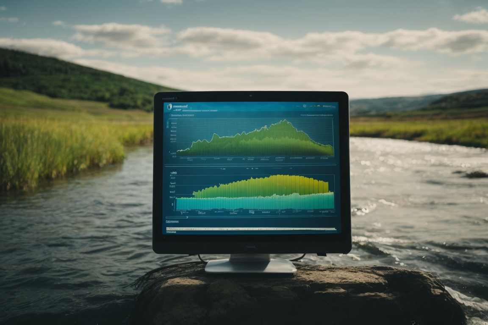

# Water Quality Analysis and Classification
This project focuses on analyzing water quality data to determine potability and classifying water samples as safe or unsafe for consumption. The analysis utilizes Python with several scientific and machine learning libraries to process the data, perform statistical analysis, and apply classification models.

- Data Analysis and Visualization
The code begins by loading a dataset from a CSV file and preparing the data for analysis. Missing values are dropped, and descriptive statistics are calculated to gain insights into the dataset.

Next, the code visualizes the distribution of safe and unsafe water potability using histograms. It also examines the impact of several factors, such as pH, hardness, total dissolved solids (TDS), chloramines, sulfate, conductivity, organic carbon, trihalomethanes, and turbidity, on water quality.

- Statistical Analysis
Statistical analysis is performed to determine the correlation between different variables. The code calculates the Pearson correlation coefficient and p-value between the "Solids" and "Potability" columns. Additionally, it evaluates the correlation between all columns in the dataset.

- Machine Learning and Classification Modeling
The code demonstrates the application of machine learning techniques to predict water potability based on turbidity. A linear regression model is trained and evaluated using the sklearn library. Additionally, the code employs the pycaret library for classification tasks. It sets up the data, compares various classification models, and creates Extra Trees and Random Forest classifiers to predict water potability.

## Usage
Please note that this code assumes the necessary libraries are installed and the dataset is provided in a CSV file named "water_potability.csv".

## Contributing
Contributions to improve the analysis or extend the features are welcome. Please fork the project, create a feature branch, and submit a pull request.

- Contact:

